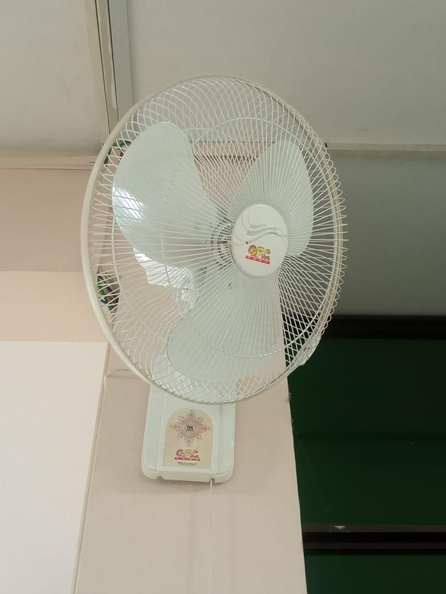
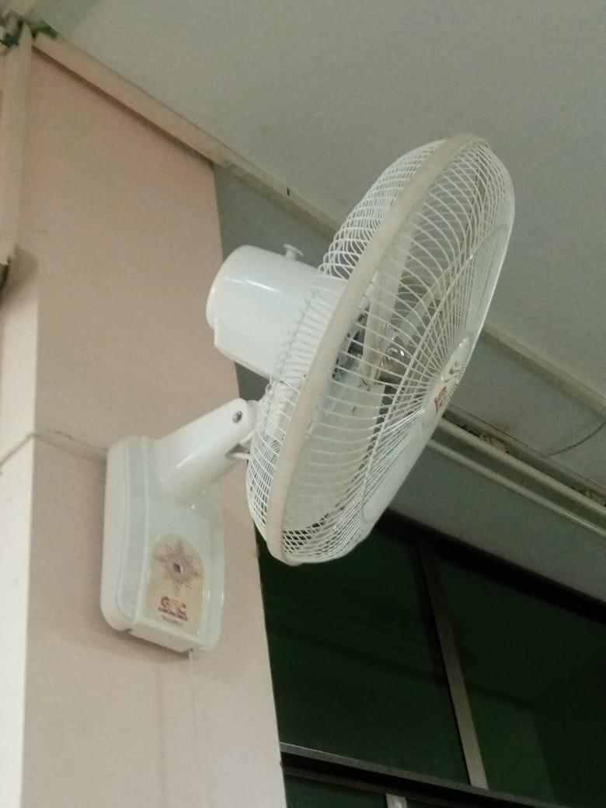
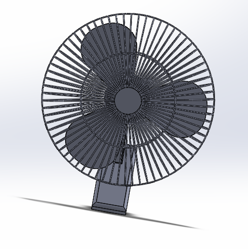
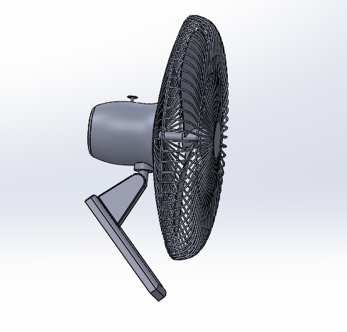

# Bracket Fan: Wall-Mounted Bracket Fan CAD Model

Bracket Fan is an academic Engineering Drawing & CAD Lab project exploring the components and CAD representation of a wall-mounted fan using SolidWorks 2020.

> **Academic Project Disclaimer:** This repository documents an academic CAD learning project. It does not represent a manufactured, commercially validated, electrically tested, or production-ready fan.

---

## Project Overview

This repository presents the 3D computer-aided design (CAD) modeling study of a wall-mounted bracket fan, completed for the Engineering Drawing & CAD Lab course at Bahria University Karachi Campus. The study examines the structural components, external geometry, and spatial assembly of a standard wall-mounted fan.

---

## Project Objective

The primary objective of this academic exercise was to analyze the physical form of an existing wall-mounted fan and learn how to represent its primary structural parts within a 3D CAD environment. The project focused on component decomposition, 3D part creation, and basic assembly techniques in SolidWorks 2020. It was not intended to produce a market-ready or commercial consumer product.

---

## Reference Object

The CAD modeling process was informed by visual observation of a real physical wall-mounted fan. Reference photographs were used to study proportional relationships, grill geometry, mounting brackets, and housing contours.

- **Reference Type:** Existing physical wall-mounted fan (visual study)
- **Role in Project:** Form and component identification reference only

---

## Main Components Studied

Based on the reference object and academic report documentation, the fan was modeled around six main structural components:

1. **Wall-Mounting Base:** The wall fixture interface supporting the assembly.
2. **Mounting Bracket:** The support arm connecting the wall base to the motor housing.
3. **Motor Housing:** The main enclosure designed to house the drive mechanism.
4. **Fan Blades:** The multi-blade rotating assembly for air propulsion.
5. **Protective Grill:** Front and rear wire enclosures surrounding the blade assembly.
6. **Overall Assembly:** The combined 3D arrangement of all individual components.

---

## Software Used

- **Primary CAD Software:** SolidWorks 2020
- **Documentation Tools:** Microsoft Word (Report Compilation)

---

## Documented Design Workflow

The project report outlines a five-stage design workflow:

1. **Conceptual Design:** Studying the reference object and preparing initial conceptual layout sketches.
2. **Component Modelling:** Modelling individual parts separately (base, bracket, housing, blades, grill).
3. **Assembly:** Combining individual 3D part files into a unified assembly model using SolidWorks mates.
4. **Final Visualization:** Generating standard view renders and model screenshots.
5. **Report Preparation:** Documenting the design process, component breakdown, and academic findings.

```
[ Conceptual Design ] -> [ Component Modelling ] -> [ Assembly Mating ] -> [ Final Visualization ] -> [ Report Preparation ]
```

---

## Team

This project was completed as a three-member academic group project.

### Muhammad Humair Ghouri
**Contribution:** Project designer

- [LinkedIn Profile](https://www.linkedin.com/in/muhammad-humair-ghouri-abb298271/)
- Email: [humairghouri11@gmail.com](mailto:humairghouri11@gmail.com)

### Aatir Shahzad
**Contribution:** Selected the Bracket Fan as the project concept

- [LinkedIn Profile](https://www.linkedin.com/in/aatir-shahzad-8207642b3/)
- Email: [aatirshahzad10@gmail.com](mailto:aatirshahzad10@gmail.com)

### Abdul Wahid Chohan
**Contribution:** Researched how the Bracket Fan could be designed and developed an understanding of the CAD design process

- [LinkedIn Profile](https://www.linkedin.com/in/abdul-wahid-chohan/)
- Email: [aw4532350@gmail.com](mailto:aw4532350@gmail.com)

For full team contribution details, see [TEAM_CONTRIBUTIONS.md](TEAM_CONTRIBUTIONS.md).

---

## Learning Outcomes

Key learning outcomes achieved during this academic lab project include:

- Understanding how a wall-mounted fan can be divided into separate structural components.
- Developing familiarity with component-based 3D CAD modelling in SolidWorks 2020.
- Applying basic concentric, coincident, and distance mates to form a complete CAD assembly.
- Studying the external geometry and proportional relationships of a physical appliance.
- Enhancing engineering documentation and technical report writing skills.
- Developing an awareness of the distinction between an academic CAD model and a production-validated engineering product.
- Practicing team collaboration during an academic laboratory project.

---

## Repository Structure

```text
bracket-fan-solidworks-cad/
├── README.md
├── LICENSE
├── CONTRIBUTING.md
├── TEAM_CONTRIBUTIONS.md
├── docs/
│   ├── project-report.pdf
│   └── workflow-diagram.png
├── images/
│   ├── reference-fan-front-view.jpg
│   ├── reference-fan-side-view.jpg
│   ├── cad-model-full-view.png
│   ├── cad-model-side-view.png
│   └── cad-assembly-view.png (Pending)
└── solidworks/
    ├── README.md
    └── Fan.SLDPRT
```

*Note: `images/cad-assembly-view.png` is currently marked as pending file availability. Original CAD screenshot previews embedded in the report are preserved under `images/`.*

---

## Project Visuals

### Section A: Reference Photographs

> **Reference Photo Label:** Reference photograph of an existing wall-mounted fan used to understand the form and components.

| Front View Reference | Side View Reference |
| :---: | :---: |
|  |  |
| *Front view of an existing wall-mounted fan used as a visual reference.* | *Side view of the reference fan showing the housing, protective grill, mounting bracket, and base.* |

### Section B: CAD Project Visuals

The images below display actual SolidWorks 2020 model screenshots generated during the project:

| Full Model CAD View | Side Model CAD View |
| :---: | :---: |
|  |  |
| *SolidWorks CAD model full view.* | *SolidWorks CAD model side view.* |

*Assembly view (`images/cad-assembly-view.png`): File not currently available. Additional exploded assembly screenshots can be added in future updates.*

---

## Difference Between Reference Photographs and CAD Screenshots

To ensure absolute information integrity, please note the distinction between visual assets:

- **Reference Photographs (`images/reference-fan-*.jpg`):** These show a pre-existing commercial appliance photographed to inspect physical form, proportions, and feature layout prior to modeling. They do NOT represent a fabricated student prototype, a manufactured model, or physical CAD output.
- **CAD Screenshots (`images/cad-model-*.png`):** These show the digital 3D virtual geometry created inside SolidWorks 2020.
- **Academic Report Statements:** Statements in the academic report regarding expected performance reflect general introductory design goals rather than physical test data.

> **Repository Clarification:** The original academic report includes descriptions of analysis and expected performance. Supporting numerical evidence is not included in this repository, so those statements should not be interpreted as independently verified results.

---

## Current Limitations

- **Academic Scope:** This repository documents an academic CAD learning project created for coursework.
- **No Physical Fabrication:** No physical prototype has been fabricated or confirmed by the student team.
- **Electrical Systems:** Electrical wiring, motor coil winding, switch gear, and electrical safety have not been implemented or tested.
- **Motor & Mechanical Testing:** Motor torque, RPM, efficiency, and power consumption have not been empirically measured.
- **Airflow & Aerodynamics:** Airflow velocity, volumetric flow rate (CFM), and blade aerodynamics have not been experimentally measured or validated.
- **Simulation Data:** The academic report discusses stress and airflow analysis, but verified simulation files or numerical results are not included in this repository.
- **Material Specifications:** Material properties, mass density, tensile strength, and manufacturing tolerances have not been formally validated.
- **Manufacturing Suitability:** The CAD geometry is intended for academic representation and should not be treated as a manufacturing-ready design.

---

## Possible Future Improvements

The following items are identified strictly as potential future enhancements:

- Refining component geometry and parametric feature dimensions.
- Defining precise engineering material properties in SolidWorks.
- Documenting assembly mates and motion constraints more comprehensively.
- Conducting properly defined Finite Element Analysis (FEA) structural simulations with documented boundary conditions.
- Conducting verified Computational Fluid Dynamics (CFD) airflow simulations with mesh convergence studies.
- Evaluating fan blade airfoil geometry using aerodynamic calculation methods.
- Integrating electrical motor and control hardware into a physical prototype.
- Fabricating a physical prototype for experimental testing.
- Preparing formal 2D engineering production drawings with geometric dimensioning and tolerancing (GD&T).

---

## How to View the Files

1. **CAD Models:** Open `solidworks/Fan.SLDPRT` using SolidWorks 2020 or a compatible newer version.
2. **Project Report:** Access `docs/project-report.pdf` using any standard PDF viewer.
3. **Workflow Diagram:** View `docs/workflow-diagram.png` directly in GitHub or any image viewer.

---

## Credits

- **Course:** Engineering Drawing & CAD (Lab)
- **Institution:** Department of Electrical Engineering, Bahria University Karachi Campus
- **Class / Semester:** RIS 1C, Fall 2024
- **Instructor / Supervisor:** Zaryab Qazi

---

## License

This repository is distributed under the [MIT License](LICENSE).

---

## Contact Information

- **Muhammad Humair Ghouri:** [LinkedIn](https://www.linkedin.com/in/muhammad-humair-ghouri-abb298271/) | Email: humairghouri11@gmail.com
- **Aatir Shahzad:** [LinkedIn](https://www.linkedin.com/in/aatir-shahzad-8207642b3/) | Email: aatirshahzad10@gmail.com
- **Abdul Wahid Chohan:** [LinkedIn](https://www.linkedin.com/in/abdul-wahid-chohan/) | Email: aw4532350@gmail.com
